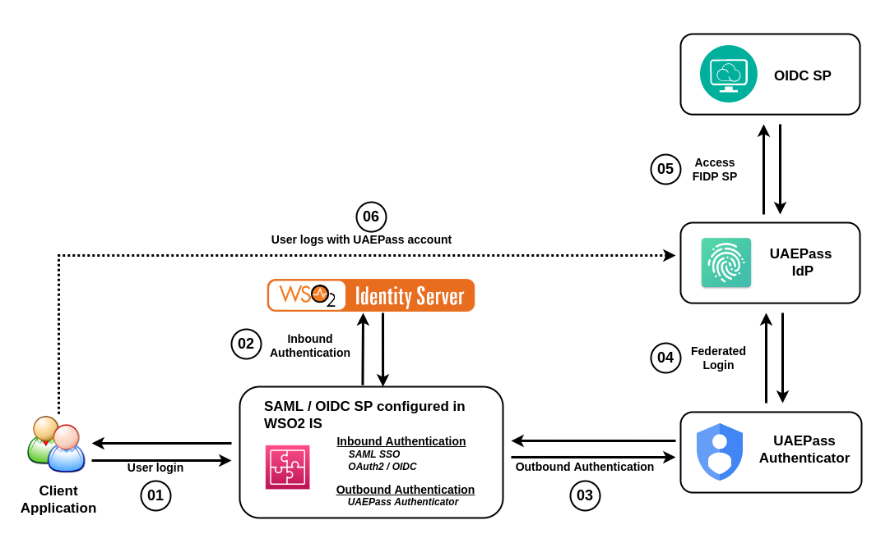

# UAEPass Authenticator
The UAEPass Authenticator is based on OpenID Connect, and is configured as
a federated authenticator in WSO2 Identity Server.
You can use UAEPass authenticator to authenticate UAEPass users in both their Staging and Production to sign in to your organization’s 
applicationsusing OpenID Connect. This connector supports for WSO2 IS from version 5.11.0 and later.

The following diagram illustrates the authentication flow of the UAEPass federated authenticator:

## Getting started
To get started with the authenticator, go to [Configuring the UAEPass Authenticator](config.md). 
Once you have completed your configurations, you can authenticate users using the UAEPass Authenticator.