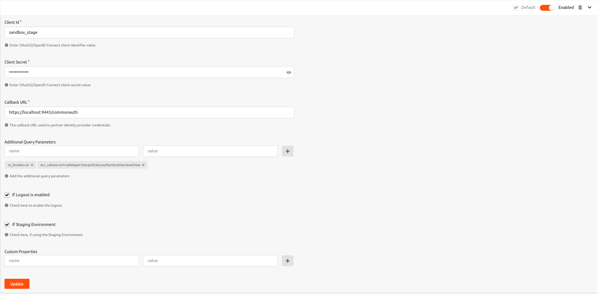

# Configuring the UAEPass Authenticator
To use the UAEPass authenticator with WSO2 Identity Server, first you need to configure  the authenticator with 
WSO2 Identity Server. The following steps provide instructions on how to configure the UAEPass authenticator with 
WSO2 Identity Server using a sample app.

In order to test the approach, First an end user account should be registered with the UAEPass staging environment 
and the end user should have to download the UAEPass [mobile app](https://docs.uaepass.ae/resources/staging-apps) for 
Staging.

After deploying the UAEPass Authenticator to WSO2 IS, the Authenticator can be configured from the 
WSO2 IS Console.

The authorize endpoint, token endpoint, userinfo endpoint, and logout endpoint are hardcoded in the source 
code for both staging and production. However, users can update these default endpoints by modifying the 
`deployment.toml` file as follows with the necessary parameters. If a user prefers to add the following configurations, 
the endpoint's default configurations may be overridden.

```toml
[[authentication.custom_authenticator]]
name="UAEPassAuthenticator"
enable=true
[authentication.custom_authenticator.parameters]
UAEPassSTGAuthzEndpoint = "https://stg-id.uaepass.ae/idshub/authorize"
UAEPassSTGUserInfoEndpoint = "https://stg-id.uaepass.ae/idshub/userinfo"
UAEPassSTGTokenEndpoint = "https://stg-id.uaepass.ae/idshub/token"
UAEPassSTGLogoutEndpoint = "https://stg-id.uaepass.ae/idshub/logout"
UAEPassPRODAuthzEndpoint = "https://id.uaepass.ae/idshub/authorize"
UAEPassPRODUserInfoEndpoint = "https://id.uaepass.ae/idshub/userinfo"
UAEPassPRODTokenEndpoint = "https://id.uaepass.ae/idshub/token"
UAEPassPRODLogoutEndpoint = "https://id.uaepass.ae/idshub/logout"
```

The [documentation](https://docs.uaepass.ae/guides/authentication/web-application/endpoints) for the UAEPass then 
include information regarding above endpoints.

Once Identity Server restarts, the bellow configurations will be getting reflected into `application-authentication.xml` 
file located in the `<IS-HOME>/repository/conf/identity` directory from the above toml file 

```xml
   <AuthenticatorConfig name="UAEPassAuthenticator" enabled="true">
      <Parameter name="UAEPassSTGAuthzEndpoint">https://stg-id.uaepass.ae/idshub/authorize</Parameter>
      <Parameter name="UAEPassSTGUserInfoEndpoint">https://stg-id.uaepass.ae/idshub/userinfo</Parameter>
      <Parameter name="UAEPassSTGTokenEndpoint">https://stg-id.uaepass.ae/idshub/token</Parameter>
      <Parameter name="UAEPassSTGLogoutEndpoint">https://stg-id.uaepass.ae/idshub/logout</Parameter>
      <Parameter name="UAEPassPRODAuthzEndpoint">https://id.uaepass.ae/idshub/authorize</Parameter>
      <Parameter name="UAEPassPRODUserInfoEndpoint">https://id.uaepass.ae/idshub/userinfo</Parameter>
      <Parameter name="UAEPassPRODTokenEndpoint">https://id.uaepass.ae/idshub/token</Parameter>
      <Parameter name="UAEPassPRODLogoutEndpoint">https://id.uaepass.ae/idshub/logout</Parameter>
   </AuthenticatorConfig>
```

UAEPass has exposed the client id and client secret of a service provider that is accessible in staging environment. [2]

According to the UAEPass Staging documentation, they have specified acr values for third-party SPs and provided default
scopes. These acr values and scopes are carried along with the authorize request as the query parameters. The following 
are the default acr values and scope.

```
acr_values: urn:safelayer:tws:policies:authentication:level:low
scope: urn:uae:digitalid:profile:general
```

If the user specifies an additional acr value or scope value in the Additional query parameter section, the default 
values will be overridden.

### _The WSO2 Console’s UI for authenticator section as follows_


#### Client ID
The consumer key of the SP configured in UAEPass. Since “sndbox stage” their  staging environment’s consumer key.

#### Client secret
The consumer secret of the SP configured in UAEPass.

#### Callback URL
Defines the redirect path after successful authentication is completed from the UAEPass. (The authorization code of the
UAEPass will be sent to the callback URL.)

Note :
Additional query parameter fields and the UAEPass Environment field are optional. Before selecting an environment, 
the authenticator verifies that the UAEPass IsStaging feature enabled. If not, the authenticator
will check the client  id. If the client id is equal to `sandbox stage`, the authenticator would pick 
_**Staging**_ as the environment. And the endpoints will be selected accordingly. However, IsStaging feature is an 
optional filed.

According to the UAEPass documentation, openid scope was not mentioned. However, UAEPass still supports access to this 
`openid` scope. Perhaps in the future it will no longer exist. Thus, the UAEPass Authenticator was designed to extract 
user claims without an id token.

IS will map the claims as usual if the token response contains an id token. Other-vice authenticator would create an API 
request to UAEPass user info endpoint, and it may observe the claims.

UAEPass IdP only supports the commonAUth logout. Hence, logout redirection will be correlated by state parameter and 
logout response. Hence, the new Authenticator introduced in passing the state parameter as a query string to the logout 
redirect URI. With the modified features, the commonAuth logout can be managed, and commonAuthLogout will be redirected 
back to the application.

### _The UAEPass authenticator's flow as follows_
