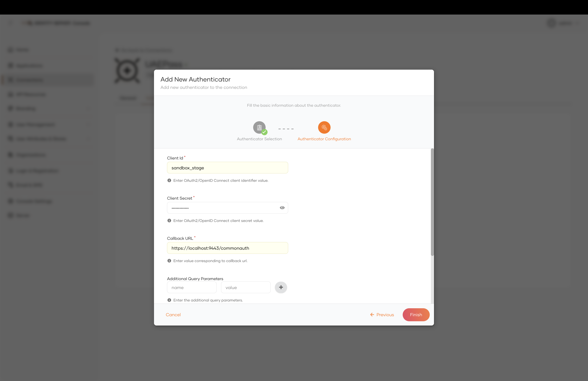
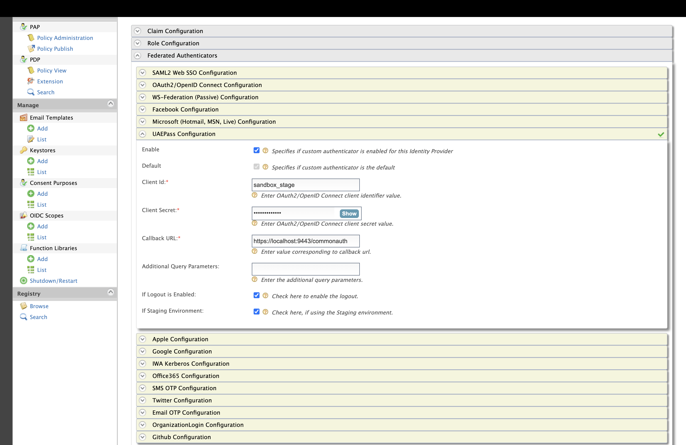
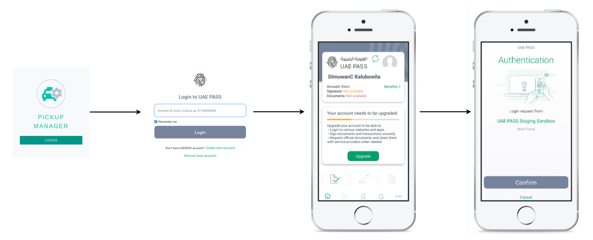

# Configuring the UAEPass Authenticator
To use the UAEPass authenticator with WSO2 Identity Server, first you need to configure  the authenticator with 
WSO2 Identity Server. The following steps provide instructions on how to configure the UAEPass authenticator with 
WSO2 Identity Server using a sample app.

## Prerequisites

1. Download the UAEPass [mobile app](https://docs.uaepass.ae/resources/staging-apps) for
   Staging.
2. Register an end-user account with the UAEPass staging environment.

## Configuring the UAEPass Authenticator

1. Download the UAEPass Authenticator from the [WSO2 Store](https://store.wso2.com/connector/identity-outbound-auth-uaepass).
2. Copy the downloaded JAR file to the `<IS_HOME>/repository/components/dropins` directory.
3. Add the following configurations to the `deployment.toml` file.

```toml
[[authentication.custom_authenticator]]
name="UAEPassAuthenticator"
enable=true
[authentication.custom_authenticator.parameters]
UAEPassSTGAuthzEndpoint = "https://stg-id.uaepass.ae/idshub/authorize"
UAEPassSTGUserInfoEndpoint = "https://stg-id.uaepass.ae/idshub/userinfo"
UAEPassSTGTokenEndpoint = "https://stg-id.uaepass.ae/idshub/token"
UAEPassSTGLogoutEndpoint = "https://stg-id.uaepass.ae/idshub/logout"
UAEPassPRODAuthzEndpoint = "https://id.uaepass.ae/idshub/authorize"
UAEPassPRODUserInfoEndpoint = "https://id.uaepass.ae/idshub/userinfo"
UAEPassPRODTokenEndpoint = "https://id.uaepass.ae/idshub/token"
UAEPassPRODLogoutEndpoint = "https://id.uaepass.ae/idshub/logout"
```
The [documentation](https://docs.uaepass.ae/guides/authentication/web-application/endpoints) for the UAEPass include information regarding above endpoints.

## Configuring UAEPass in the WSO2 IS Console

### Identity Server 7.0.0 and later


1. Log in to the WSO2 Identity Server Console.
2. Navigate to `Connections` > `New Connection` > `Custom Connector` and create a new connector.
3. Select the created connector and go to the Settings tab.
4. Click `New Authenticator` and select `UAEPassAuthenticator`.
5. Enter the required configuration details (as specified below).



### Older versions of Identity Server
1. Log in to the WSO2 Identity Server Management Console.
2. Navigate to `Identity Providers` > `Add` and create a new identity provider.
3. Go to the `Federated Authenticators` section and expand the `UAEPass Configuration` section.
4. Enter the required configuration details (as specified below)



## Configuration Details for UAEPass Authenticator

### Required Fields

#### Client ID
The consumer key of the SP configured in UAEPass. For the staging environment, the client ID is `sandbox_stage`.

#### Client secret
The consumer secret of the SP configured in UAEPass. For the staging environment, the client secret is `sandbox_stage`.

#### Callback URL
Defines the redirect path after successful authentication is completed from the UAEPass. The default callback URL is 
`https://localhost:9443/commonauth`.

### Optional Fields

#### Additional Query Parameters
Allows you to include static or dynamic query parameters for the UAEPass authorization request.

According to the UAEPass Staging documentation, they have specified acr values for third-party SPs and provided default 
scopes. These acr values and scopes are carried along with the authorize request as the query parameters. The following
are the default acr values and scope.

```
acr_values: urn:safelayer:tws:policies:authentication:level:low
scope: urn:uae:digitalid:profile:general
```

#### If Staging Environment
Before selecting an environment, the authenticator verifies that the UAEPass IsStaging feature enabled. If not, the authenticator
will check the client  id. If the client id is equal to `sandbox stage`, the authenticator would pick 
_**Staging**_ as the environment. And the endpoints will be selected accordingly.

#### If Logout is Enabled
UAEPass IdP only supports the commonAUth logout. Hence, logout redirection will be correlated by state parameter and 
logout response. Hence, the new Authenticator introduced in passing the state parameter as a query string to the logout 
redirect URI. With the modified features, the commonAuth logout can be managed, and commonAuthLogout will be redirected 
back to the application.

### Note

According to the UAEPass documentation, openid scope was not mentioned. However, UAEPass still supports access to this
openid scope. Perhaps in the future it will no longer exist. Thus, the UAEPass Authenticator was designed to extract
user claims without an id token.

IS will map the claims as usual if the token response contains an id token. Other-vice authenticator would create an
API request to UAEPass user info endpoint, and it may observe the claims.

## Enable error page redirection (v1.1.3 or later)

1. Download the [uaePassError.jsp](../components/uaepass-authenticator/src/webapp/uaePassError.jsp) file and copy it to the `<IS_HOME>/repository/deployment/server/webapps/authenticationendpoint` directory.
2. Add the following to the `deployment.toml` file alongside with other configs.
```toml
[[authentication.custom_authenticator]]
UAEPassAuthenticationEndpointErrorPage = "authenticationendpoint/uaePassError.jsp"
```

3. Append the below content to the `Resource.properties` file [1].
If you are using the other language properties, It is required to add the translated content of the below configurations to those files as well(Eg : Resources_fr_FR.properties file).
```aidl
# UAE Pass
error.uaepass.title=Failed Authentication with UAE Pass
error.uaepass.cancelled=Authentication cancelled by the user.
```

[1]<IS_HOME>/repository/deployment/server/webapps/authenticationendpoint/WEB-INF/classes/org/wso2/carbon/identity/application/authentication/endpoint/i18n/Resources.properties

### _The UAEPass authenticator's flow as follows_
