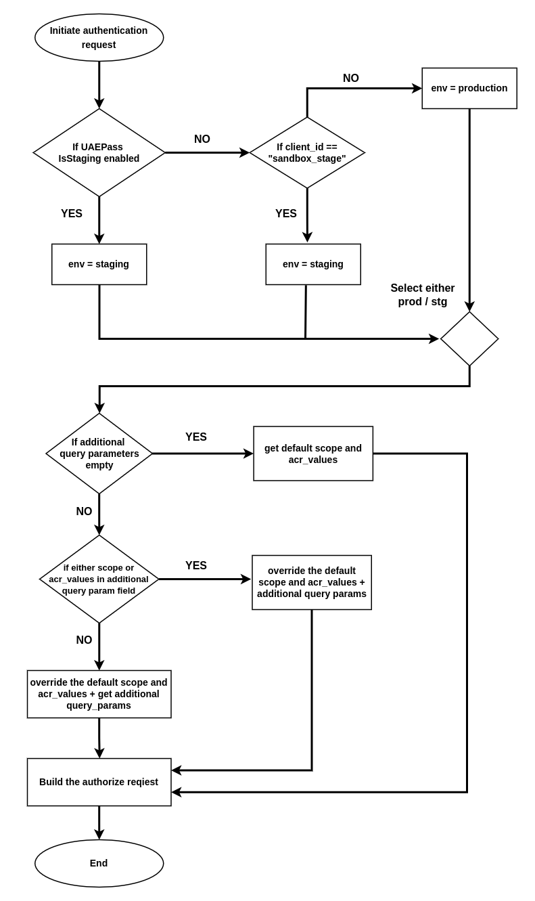
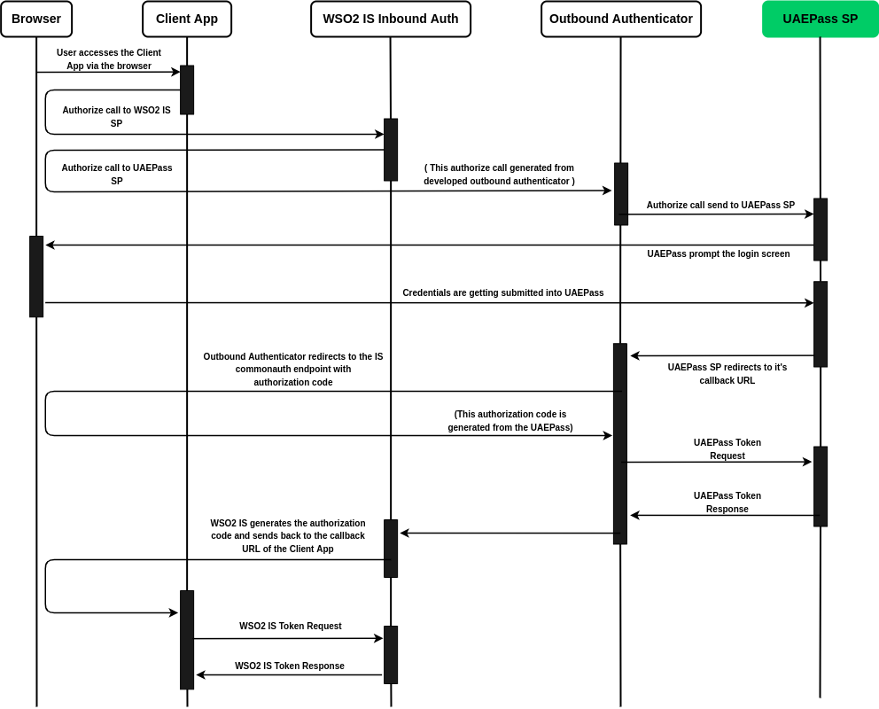
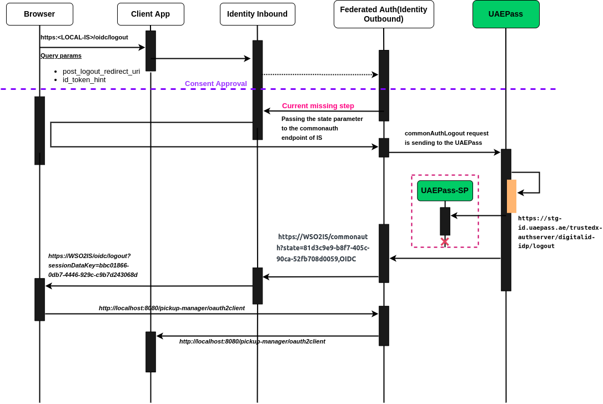

# UAE Pass Technical Workflow

**The following flow chart includes the control flow, which illustrates how authenticator sends a valid authorize request
according to the particular environment and the query parameters selection.**

**The bellow sequence diagrams shows how authenticator's login and logout flow working.**
1. Login flow

2. Logout flow

